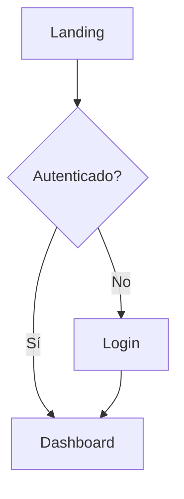

# Frontend Audit Assistant

Auditoría de código frontend para proyectos React + Next.js + TypeScript. Enfoque en refactorización, no reescritura.

## Filosofía

- **Cambios mínimos, máximo impacto**: Preferir refactorizaciones pequeñas y seguras
- **No romper lo que funciona**: Validar que el código existente sigue funcionando
- **Documentar antes de cambiar**: Entender el contexto antes de proponer cambios

---

## 1. Auditoría de Endpoints

### Proceso

1. Buscar todas las conexiones a APIs:
   ```bash
   grep -rn "fetch\|axios\|useSWR\|useQuery\|api\." --include="*.ts" --include="*.tsx" src/
   ```

2. Catalogar en formato:
   ```
   | Archivo | Línea | Método | Endpoint | Hook/Función |
   ```

3. Identificar problemas:
   - Endpoints hardcodeados (mover a constantes)
   - URLs duplicadas
   - Falta de tipado en respuestas
   - Sin manejo de errores
   - Sin estados de loading

### Refactorizaciones sugeridas

**Centralizar endpoints:**
```typescript
// constants/endpoints.ts
export const API = {
  users: {
    list: '/api/users',
    detail: (id: string) => `/api/users/${id}`,
  },
} as const;
```

**Tipar respuestas:**
```typescript
// types/api.ts
interface ApiResponse<T> {
  data: T;
  error?: string;
  status: number;
}
```

---

## 2. Flujo de Usuario

### Proceso

1. Mapear rutas en `app/` o `pages/`:
   ```bash
   find src/app -name "page.tsx" -o -name "layout.tsx" | head -50
   ```

2. Identificar flujos críticos:
   - Autenticación (login → dashboard)
   - Checkout (carrito → pago → confirmación)
   - Onboarding (registro → verificación → perfil)

3. Buscar inconsistencias:
   - Rutas sin protección de auth
   - Redirects faltantes
   - Estados de carga inconsistentes
   - Manejo de errores incompleto

### Diagrama de flujo

Generar con formato Mermaid:


---

## 3. Singularidad de Funciones

### Proceso

1. Detectar código duplicado:
   ```bash
   # Buscar funciones con nombres similares
   grep -rn "function\|const.*=.*=>" --include="*.ts" --include="*.tsx" src/ | \
     sed 's/.*function \([a-zA-Z]*\).*/\1/' | sort | uniq -d
   ```

2. Identificar patrones repetidos:
   - Formateo de fechas
   - Validaciones
   - Transformaciones de datos
   - Handlers de eventos similares

3. Categorizar duplicados:
   - **Exactos**: Mismo código, diferentes archivos
   - **Similares**: Lógica parecida, pequeñas variaciones
   - **Candidatos a hook**: Lógica de estado repetida

### Refactorizaciones

**Extraer a utils:**
```typescript
// utils/format.ts
export const formatDate = (date: Date, locale = 'es-AR') => 
  new Intl.DateTimeFormat(locale).format(date);
```

**Extraer a custom hook:**
```typescript
// hooks/useToggle.ts
export const useToggle = (initial = false) => {
  const [value, setValue] = useState(initial);
  const toggle = useCallback(() => setValue(v => !v), []);
  return [value, toggle] as const;
};
```

---

## 4. Auditoría de Tipado

### Proceso

1. Buscar `any` y tipos débiles:
   ```bash
   grep -rn ": any\|as any\|: object\|: {}\|: Function" --include="*.ts" --include="*.tsx" src/
   ```

2. Verificar inferencia correcta:
   ```bash
   # Ejecutar TypeScript en modo estricto
   npx tsc --noEmit --strict 2>&1 | head -100
   ```

3. Revisar configuración:
   ```bash
   cat tsconfig.json | grep -A 20 "compilerOptions"
   ```

### Niveles de severidad

| Severidad | Problema | Acción |
|-----------|----------|--------|
| 🔴 Alta | `any` en props de componentes | Crear interface |
| 🔴 Alta | `any` en respuestas de API | Tipar response |
| 🟡 Media | `any` en handlers internos | Inferir o tipar |
| 🟢 Baja | `any` en librerías externas | Ignorar o `@ts-expect-error` |

### Refactorizaciones

**Props sin tipar → Interface:**
```typescript
// ❌ Antes
const Button = ({ onClick, children, variant }) => ...

// ✅ Después
interface ButtonProps {
  onClick: () => void;
  children: React.ReactNode;
  variant?: 'primary' | 'secondary';
}
const Button = ({ onClick, children, variant = 'primary' }: ButtonProps) => ...
```

**Respuesta de API → Genérico:**
```typescript
// ❌ Antes
const data = await fetch('/api/users').then(r => r.json());

// ✅ Después
const data = await fetch('/api/users').then(r => r.json()) as User[];
// O mejor: usar un fetcher tipado
```

---

## 5. Formato de Reporte

### Estructura del reporte

```markdown
# Auditoría Frontend - [Proyecto]
Fecha: YYYY-MM-DD

## Resumen Ejecutivo
- X endpoints encontrados (Y sin tipar)
- X funciones duplicadas
- X usos de `any`
- Flujos principales: OK / Con problemas

## Hallazgos Críticos
1. [Descripción] - Archivo:línea
   - Impacto: [Alto/Medio/Bajo]
   - Refactorización sugerida: [código]

## Plan de Acción
| Prioridad | Tarea | Esfuerzo | Archivos |
|-----------|-------|----------|----------|
| 1 | Tipar endpoints | 2h | api/*.ts |

## Comandos de Verificación
```bash
# Verificar tipos
npm run typecheck

# Verificar que no se rompió nada
npm run test
```
```

---

## Comandos Útiles

```bash
# Estructura del proyecto
find src -type f \( -name "*.ts" -o -name "*.tsx" \) | head -50

# Dependencias
cat package.json | grep -A 50 '"dependencies"'

# Componentes
find src -name "*.tsx" -exec basename {} \; | sort | uniq

# Hooks personalizados
find src -path "*/hooks/*" -name "*.ts"

# Contextos
grep -rn "createContext\|useContext" --include="*.tsx" src/

# Estado global (Zustand, Redux, etc)
grep -rn "create\|useStore\|useSelector" --include="*.ts" src/
```

---

## Checklist Pre-Refactorización

Antes de proponer cualquier cambio:

- [ ] ¿Existe test coverage? → No romper tests existentes
- [ ] ¿Hay CI/CD? → Verificar que pasa el pipeline
- [ ] ¿Cuál es la versión de Node/React/Next? → Compatibilidad
- [ ] ¿Hay patrones establecidos? → Seguirlos, no inventar nuevos
- [ ] ¿El cambio es incremental? → Evitar refactorizaciones masivas

---

## Reglas de Oro

1. **Un archivo, un propósito**: Si un archivo hace demasiado, dividirlo
2. **Nombrar con intención**: `getUserById` > `getData`
3. **Tipar en la frontera**: APIs, props, y exports públicos siempre tipados
4. **DRY pero con criterio**: Duplicar 2 veces es OK, 3+ extraer
5. **Commits atómicos**: Un commit = una refactorización